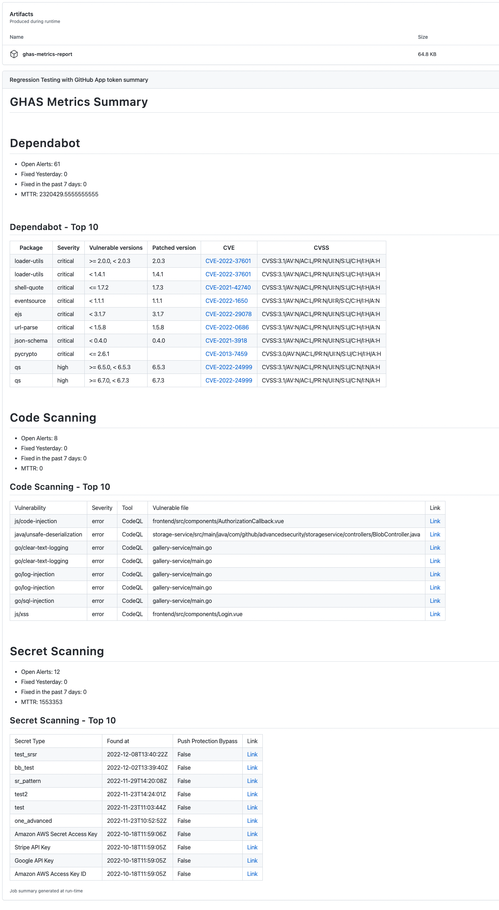

# GitHub Advanced Security - Metrics Report Action

## Introduction

A GitHub Action for generating scheduled reports for GitHub Advanced Security alerts.

The action is currently intended to be used on a repository level. The way to setup is adding a new Actions workflow file that runs this action on a scheduled interval once a day.

This action will generate GHAS Metric report for the previous day. The report is generated in the form of a JSON or PDF file which we upload as an Action run artifact. The report can also be reported in a new Issue in a repository along with separate Issues for the opened GHAS alerts.
Additionally it prints the summarized report as an Action run Summary.

The report will include the following metrics for Dependabot, Code Scanning and Secret scanning:

- Open alerts
- Fixed alerts in the past X days _(X is the frequency of the report)_
- Opened in the past X days _(X is the frequency of the report)_
- Total MTTR (Mean Time To Remediate)
- Total MTTD (Mean Time To Detect) for Code Scanning and Secret Scanning _(Note: This is experimental. It hasn't been worked out properly, yet!)_

## Development

This Action can be executed as a script with `npx`. In order to do that:

1. copy `.env.sample` to a new `.env` file and replace the variables with the desired values.
2. Keep both GITHUB_ACTION and RUN_USING_ACT variables as `true`
3. The output will be written to `json` or `pdf` files

## Usage

This action uses the GitHub API and requires a GitHub access token. The suggested way to do it is by using `peter-murray/workflow-application-token-action@v2`. Follow the [steps described](https://github.com/peter-murray/workflow-application-token-action#creating-a-github-application) in the README of the action to set up a GitHub App and use it with the Action.

Official documentation on how to create a GitHub App can also be found on: [Creating a GitHub App](https://docs.github.com/en/developers/apps/creating-a-github-app)

Invoking GHAS Metrics Report action is as simple as:

```yaml
  - name: Generate GHAS Metrics Report
        uses: theztefan/ghas-metric-report
        env:
          GITHUB_TOKEN: ${{ secrets.GITHUB_TOKEN }}
        with:
          repo: "Repo-name"
          org: "Organization-name"
          features: "dependabot, code-scanning, secret-scanning" # comma separated list of features.
          frequency: "weekly" # "weekly" or "monthly" or "daily"
```

### Example workflow using the action

```yaml
name: "GitHub Advanced Security - Metrics Report Action"
on:
  schedule:
    - cron: "30 5 * * *" # Run every day at 5.30

jobs:
  ghas-metrics-report:
    name: GitHub Advanced Security - Metrics Report Action
    runs-on: ubuntu-latest
    steps:
      - name: Get Token
        id: get_workflow_token
        uses: peter-murray/workflow-application-token-action@v2
        with:
          application_id: ${{ secrets.APPLICATION_ID }}
          application_private_key: ${{ secrets.APPLICATION_PRIVATE_KEY }}
      - name: Generate GHAS Metrics Report
        uses: theztefan/ghas-metrics-report
        env:
          GITHUB_TOKEN: ${{ steps.get_workflow_token.outputs.token }}
        with:
          repo: ${{ github.event.repository.name }}
          org: ${{ github.repository_owner }}
          features: "dependabot, code-scanning, secret-scanning"
          frequency: "daily"
          output-format: "json, pdf, issues, github-output"
      - name: Upload GHAS metrics report as artifact
        uses: actions/upload-artifact@v3
        with:
          name: ghas-metrics-report
          path: ${{ github.workspace }}/ghas-report.*
```

### Available options

Currently the action supports the following configuration options:

- `repo` - The name of the repository to generate the report for. This is a required field.
- `org` - The name of the organization to generate the report for. This is a required field.
- `features` - A comma separated list of features to generate the report for. This is a required field. The supported values are: `dependabot`, `code-scanning` and `secret-scanning`.
- `frequency` - Used to calculate the `Fixed alerts in the past X days`. Possible values are `daily`, `weekly`, `monthly`.
- `ouput-format` - The format of the report. A comma separated list of values for the output format. Supported currently: `json`, `pdf`, `issues`, `github-output`. Default is `json, pdf`.

_⚠️ Warning ⚠️: `issues` output is inteded to be used only on single `Repository` scope. It will most probablly hit API rate limits when used on `Organization` level._

### Output

The action will output:

- The report in JSON format in `report-json` variable. You can use `${{ steps.generate-report.outputs.report-json }}` in subsequent jobs to process the report.
- The report in PDF format will generate a PDF file.
- THe `issues` output will create Issues for each new open alert in the given `frequency` to the repository.
- Summarized report as an Action run Summary.
- It is also generate the report in the defined `output-format` as an artifact. You can upload these using `actions/upload-artifact@v3` as shown in the example workflow.



### GitHub Enterprise Server support

You can use this action with GitHub Enterprise Server by setting the `GITHUB_API_URL` environment variable to the URL of your GitHub Enterprise Server instance. For example, if your GitHub Enterprise Server instance is at `https://github.example.com`, you would set `GITHUB_API_URL` to `https://github.example.com/api/v3`.

```yaml
name: "GitHub Advanced Security - Metrics Report Action"
on:
  schedule:
    - cron: "30 5 * * *" # Run every day at 5.30

jobs:
  ghas-metrics-report:
    name: GitHub Advanced Security - Metrics Report Action
    runs-on: ubuntu-latest
    steps:
      - name: Get Token
        id: get_workflow_token
        uses: peter-murray/workflow-application-token-action@v2
        with:
          application_id: ${{ secrets.APPLICATION_ID }}
          application_private_key: ${{ secrets.APPLICATION_PRIVATE_KEY }}
      - name: Generate GHAS Metrics Report
        uses: theztefan/ghas-metrics-report
        env:
          GITHUB_TOKEN: ${{ steps.get_workflow_token.outputs.token }}
          GITHUB_API_URL: "https://github.example.com/api/v3"
        with:
          repo: ${{ github.event.repository.name }}
          org: ${{ github.repository_owner }}
          features: "dependabot, code-scanning, secret-scanning"
          frequency: "daily"
          output-format: "json, pdf, issues, github-output"
      - name: Upload GHAS metrics report as artifact
        uses: actions/upload-artifact@v3
        with:
          name: ghas-metrics-report
          path: ${{ github.workspace }}/ghas-report.*
```

⚠️ Important ⚠️: The dependabot REST API is not supported on GitHub Enterprise Server bellow version 3.8.0. If you are using a version of GitHub Enterprise Server bellow 3.8.0, you will need to remove `dependabot` from the `features` input.

## Contributing
- Create an issue to the repo with suggestions and bugs
- Raise a pull request :)
